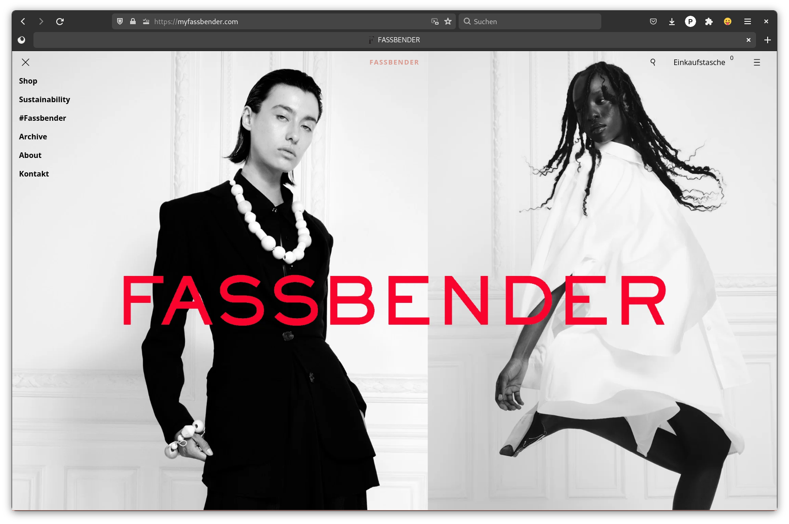

# Fassbender Shopify Theme

This is a custom Shopify theme designed for [Fassbender](https://myfassbender.com/).



## Getting Started with Development

### Prerequisites
Ensure you have the following installed:
- [Node.js](https://nodejs.org/en/) (Version 20 or later)
- [Yarn](https://yarnpkg.com/)
- [Shopify CLI](https://shopify.dev/docs/themes/tools/cli/install)

### Setting up the Project
Clone the repository and install dependencies:
```bash
git clone git@github.com:ArtCodeStudio/fassbender-shopify-theme.git
cd fassbender-shopify-theme
yarn install
```

To build the theme:

```bash
yarn build
```

To automatically watch for and reload changes:

```bash
yarn watch
```

To pull changes made through Shopify's Theme Editor:

```bash
yarn pull:customization
```

To publish a new version of the theme to Shopify:
  
```bash
yarn run push:rc
```

Additional developer scripts can be found in [package.json](package.json).

## License

This theme is available under the MIT License. For more information, see the [LICENSE](LICENSE) file.
